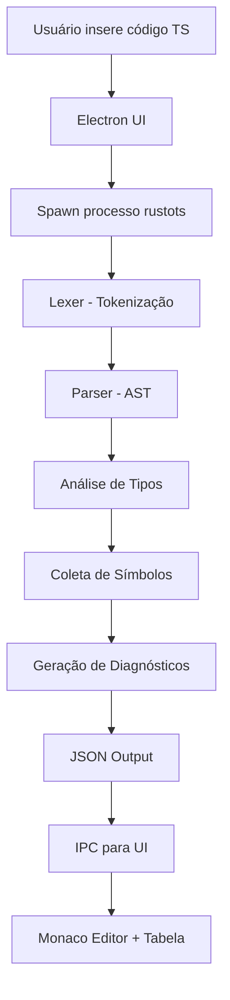

# Fluxograma do Sistema

## Processo de Análise

## Componentes

- **UI (Electron/React)**: Interface do usuário
- **Core (Rust)**: Motor de análise
- **IPC**: Comunicação entre processos
- **Monaco**: Editor de código
- **JSON Schema**: Contrato de dados
